# FontEnd
This is a basic WEB UI frontend for the application <code>https://github.com/pipspritam/JavaRESTAPI.git</code>  
This project was generated with [Angular CLI](https://github.com/angular/angular-cli) version 16.2.2.

## Requirements
* JDK 20 (java)
* Mongodb
* Spring Boot support in Visual Studio Code
* Angular
* Node.JS

## How to run the application
* Initially clone the backend application.
* Clone the backend project: <code> git clone https://github.com/pipspritam/JavaRESTAPI.git </code>
* Run the backend application.
* Clone this project: <code> git clone https://github.com/pipspritam/serverInfoFontEnd.git </code>
* Run `ng serve` for a dev server. Navigate to `http://localhost:4200/`.

## Sample Outputs
## 1. Home Page
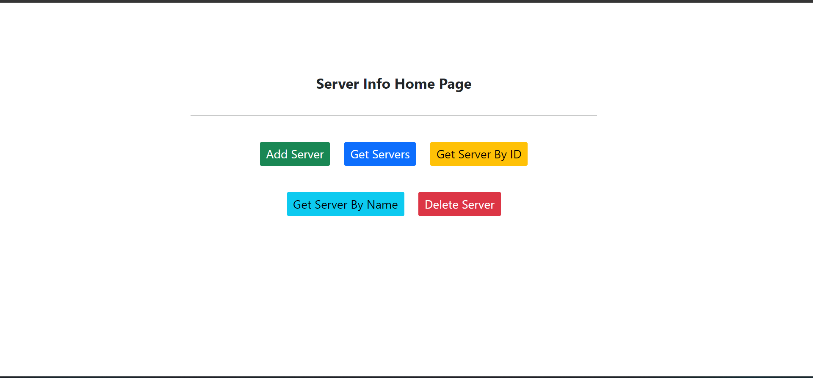 

## 2. Add New Server

 Fill all the required field to add new server info in the database

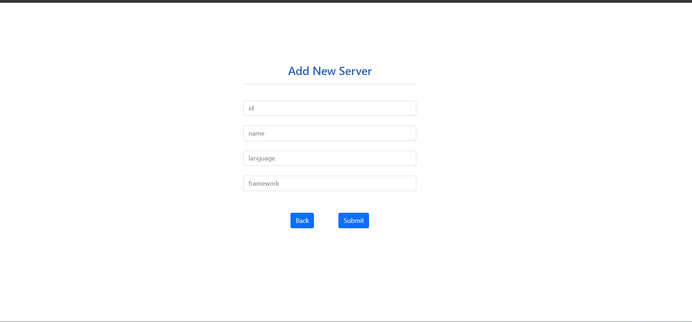 

### Case 1: Data Added Successfully
 
### Case 2: Data Already Exist
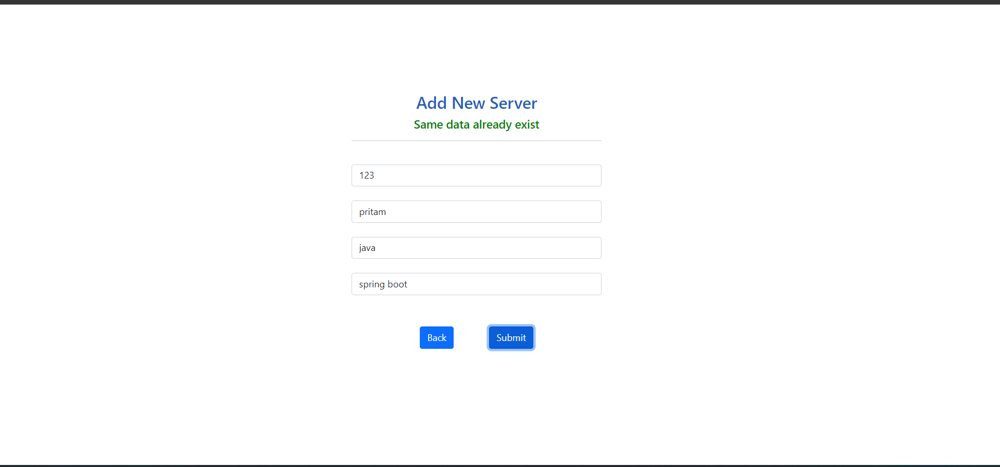 
### Case 3: Data Field Is Missing
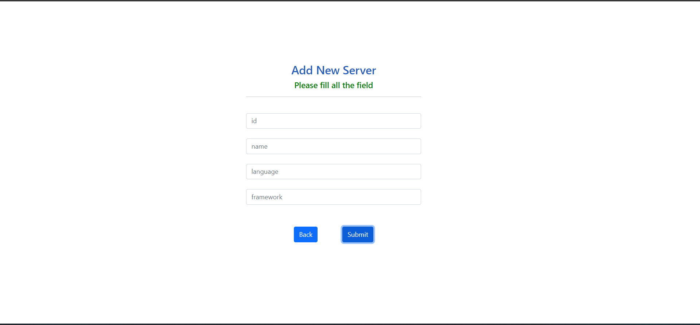 

## 3. Get All Servers

Retrieve all the serverInfo from database

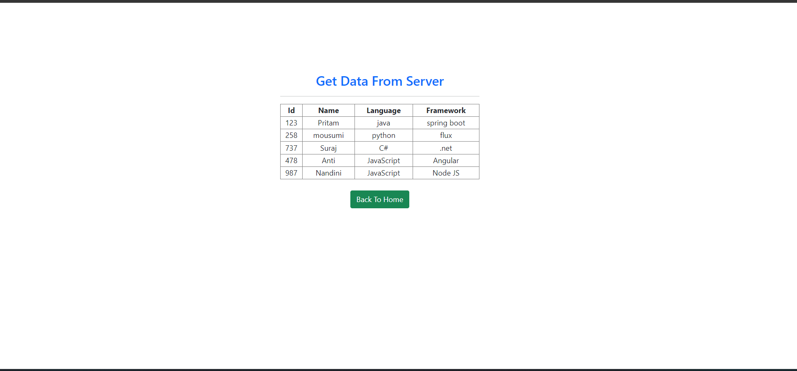 

## 4. Get Server By ID

Retrieve a particuler serverInfo by ID

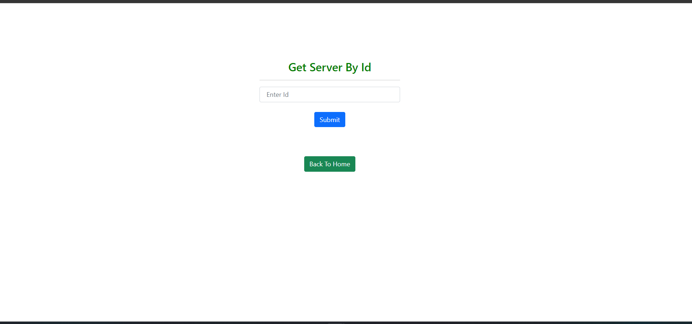 

### Case 1: ServerInfo with given ID is present in database
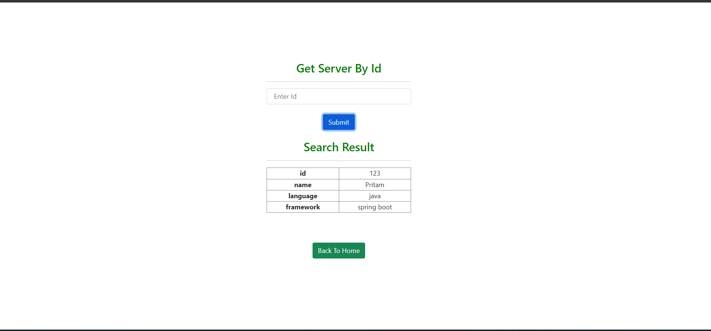 
### Case 2: ServerInfo with given ID is not present in database
 

## 5. Get Server By Name

Retrieve one or more serverInfo by Name

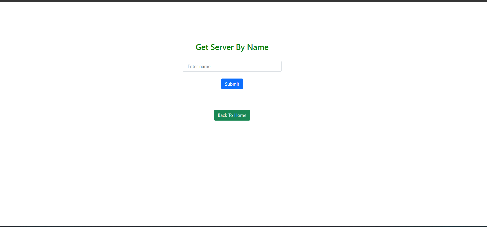 

### Case 1: ServerInfo with given name is present in database
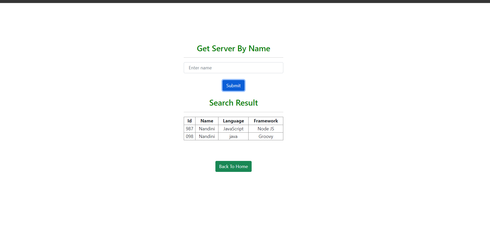 
### Case 2: ServerInfo with given name is not present in database
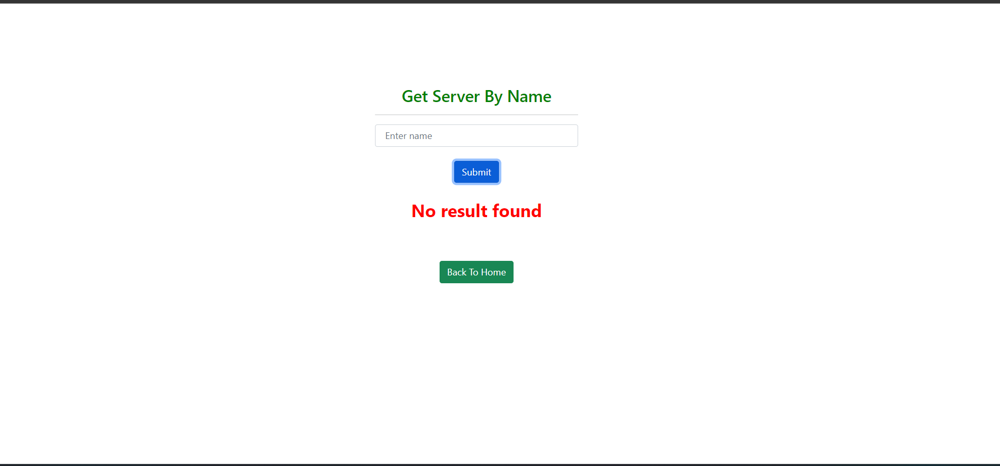 

## 6. Delete Server By ID

Delete a particuler serverInfo by ID

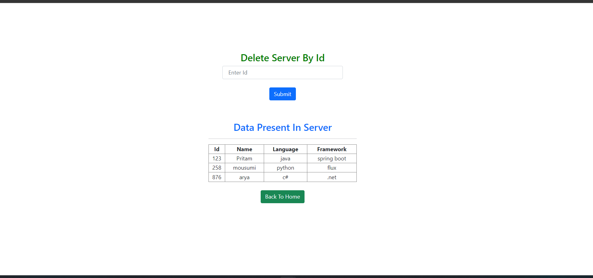 

### Case 1: ServerInfo with given ID deleted from database
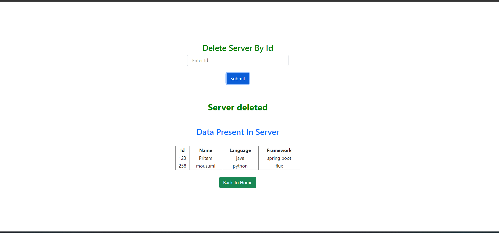 
### Case 2: ServerInfo with given ID for deletion is not present in database
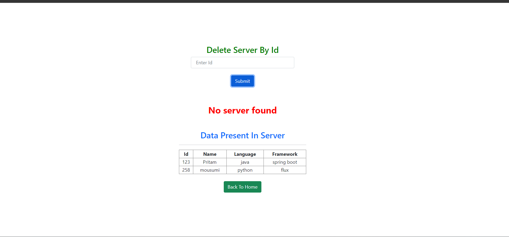 

